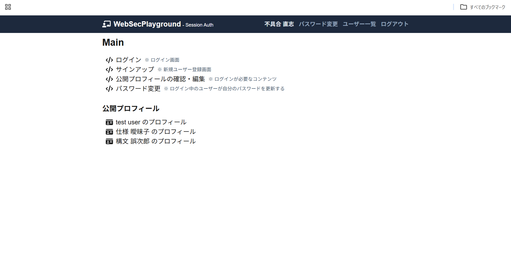
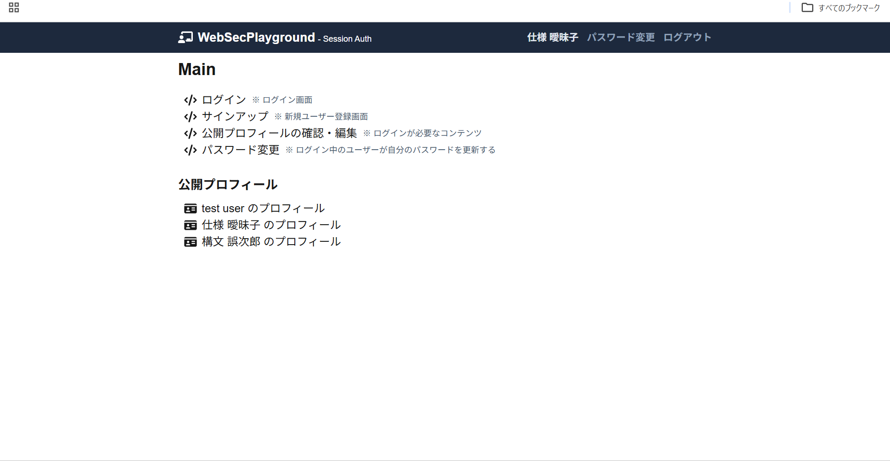
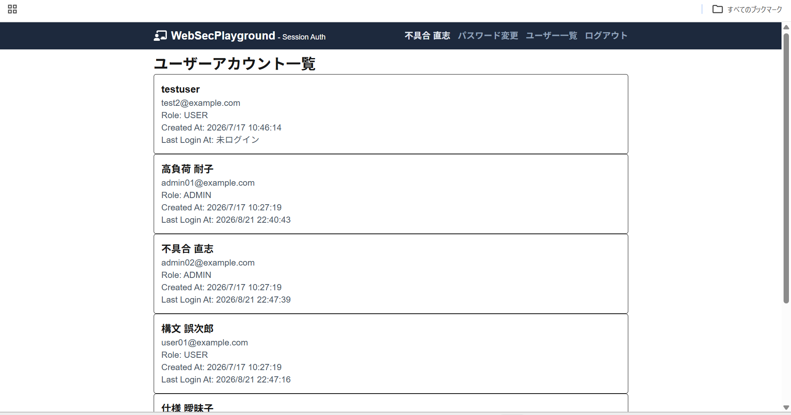
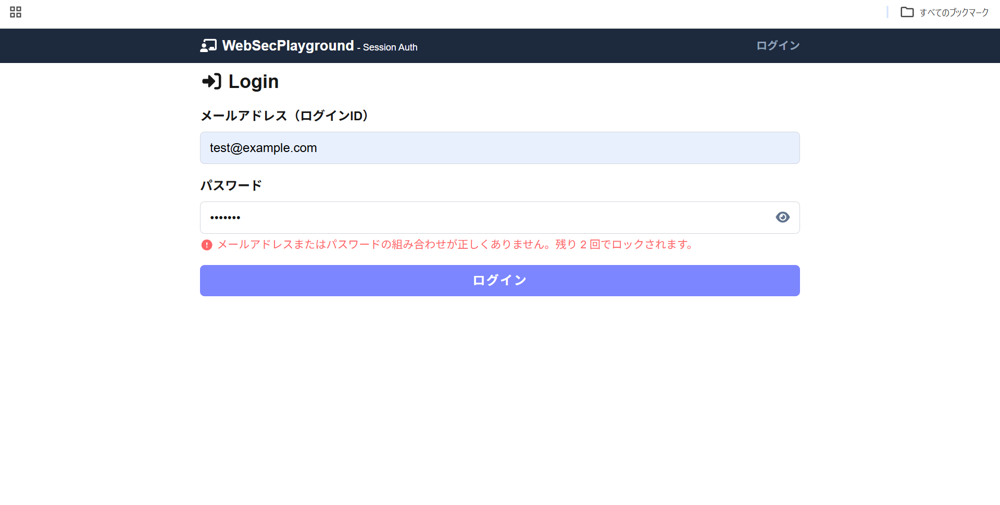
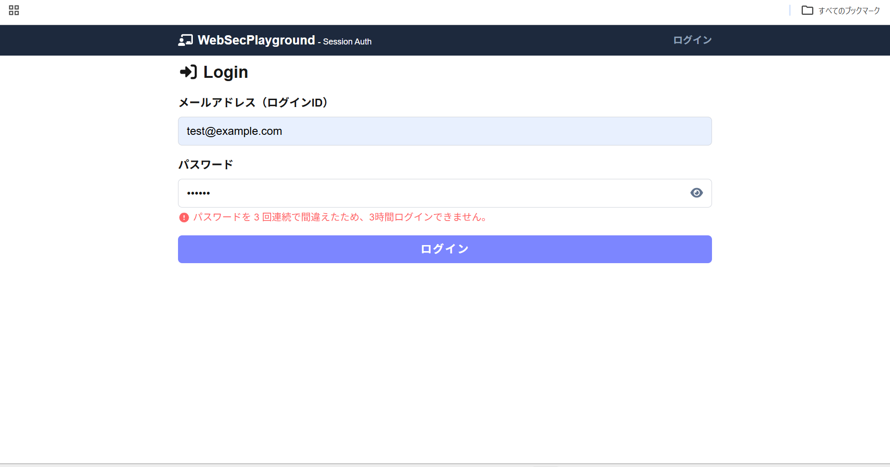
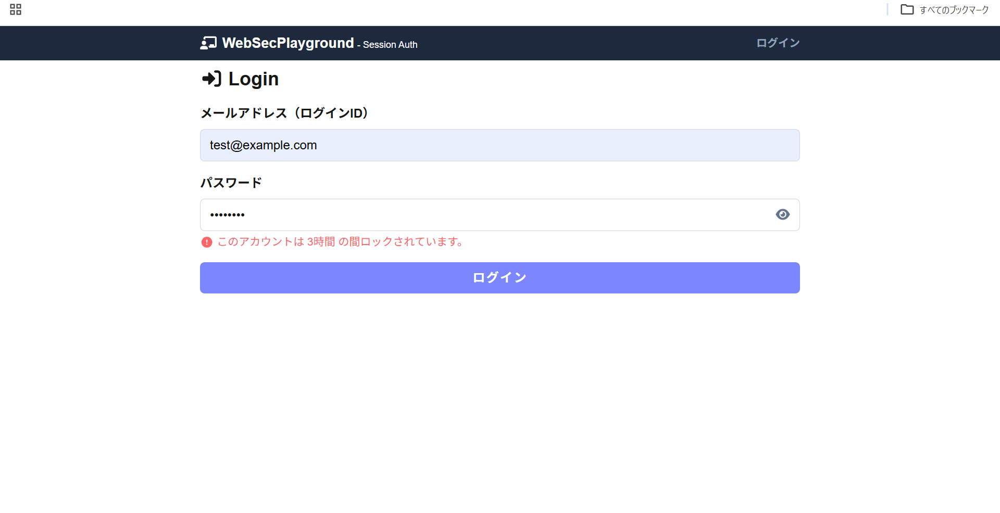
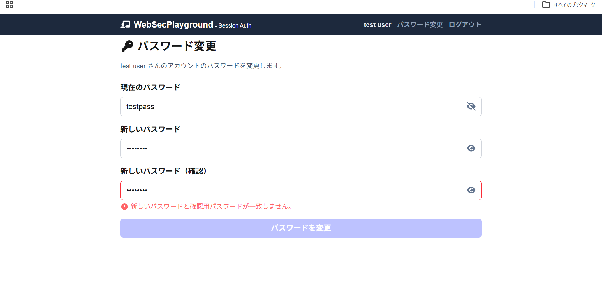
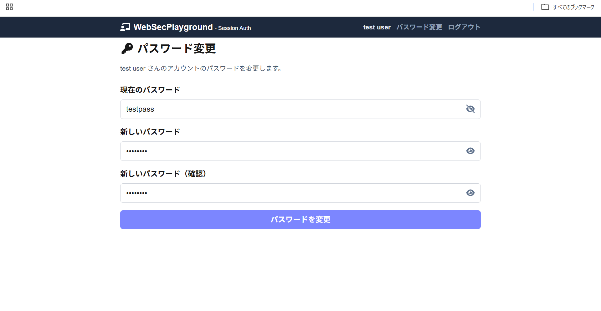

# Web Security Playground

## 概要

このプロジェクトは、Webアプリケーションにおける認証・認可・セッション管理・XSS対策を学ぶためのセキュリティ実験用アプリケーションです。
実習で使用したリポジトリを基に、セキュリティーの機能を追加しました。
本アプリは Next.js、Prisma、SQLite を用いて構築しており、以下の要素を実装しています。

- セッションベース認証
- ロールによる権限管理
- ログイン失敗回数によるアカウントロック
- セッションタイムアウト
- パスワード変更機能
- 公開プロフィール管理
- XSS対策（DOMPurify によるサニタイズ）

---

## 機能説明

### 1. セッションベース認証

ログイン時に `session_id` Cookie を発行し、サーバー側で `Session` テーブルを保持する仕組みを採用しています。

- ログイン成功時に `createSession()` を呼び出し、セッションを作成
- セッション ID を Cookie に保存
- `verifySession()` で Cookie を検証し、ユーザー特定
- セッションの有効期限を自動で更新

この設計により、ブラウザにセッション ID を保持させるのではなく、サーバー側で管理するセッション認証の動きを確認できます。

### 2. ロールによる権限管理

`ADMIN` と `USER` の2つのロールを持つ設計にしています。

- `ADMIN` はユーザー一覧の閲覧が可能
- `USER` は自分の情報や自分のパスワード変更に限定
- API 側で `requireRole()` を使ってアクセス制御
- 画面側でも `userProfile.role` を見て表示制御

### 管理者ユーザー画面

### 通常ユーザー画面

### ユーザー一覧画面

単純に `if (user.role === "ADMIN")` ではなく、`allowedRoles` を配列で受け取る汎用的な `requireRole()` にしてあります。

これにより、

- 管理者専用ページ
- 管理者専用 API
- 特定ユーザーのみアクセスできる処理

などを簡潔に追加できるようにしています。

### 3. ログイン失敗回数による制限

ログイン時に以下の処理を追加しました。

- パスワードを連続して 3 回間違えるとアカウントをロック
- ロック中はログイン API で `423` を返す
- ロックは 3 時間有効
- 1 回でも成功すると `failedLoginAttempts` をリセット
- 失敗回数が残り 1 回、2 回の段階でユーザーにメッセージを表示

実装では、`User` モデルに以下のフィールドを追加しました。

- `failedLoginAttempts`
- `lockedUntil`

無差別に連打してアカウントを総当たり的に試すことを抑制するしています。

画面側では、

- 「残り 2 回でロックされます」
- 「3時間ログインできません」

のようなメッセージをそれぞれ表示するようにしています。

### ログイン失敗時の表示

### 4. セッションタイムアウト機能

セッションの有効期間を 3 時間に設定し、以下の挙動を実装しました。

- `SESSION_TIMEOUT_SECONDS` で共通管理
- `verifySession()` 実行時にセッションの有効期限を更新
- 期限切れの場合は Cookie と DB のセッションを削除
- 画面アクセス時に認証切れを検知して再ログインを促す

### 5. パスワード変更機能

ログイン中のユーザーが、自分のパスワードを変更できる機能を追加しました。

- 現在のパスワード入力が必要
- 新しいパスワードと確認用パスワードの一致確認
- 旧パスワードと同じ新パスワードは拒否
- `bcryptjs` でハッシュ化して保存
- 変更完了後、フォームをリセットして成功メッセージを表示

また、パスワード入力欄に「目のアイコン」を設置し、表示・非表示を切り替えられるようにしました。

### パスワード変更画面

### 6. プロフィール編集と XSS 対策

プロフィールページでは、ユーザーが HTML を含む文章を入力して保存できる許可対象は最低限に絞り、`script` や `onerror`、危険な URL を削除する設計にしています。

- `sanitizeHtml()` を作成
- `DOMPurify` を利用して危険なタグや属性を除去
- 保存時にサニタイズして値を DB に保存
- 表示時にも再度サニタイズしてHTMLを描画

これにより、攻撃者が悪意あるスクリプトを注入しても、ブラウザ上では実行されないようにしています。

### 7. パスワード入力欄の UX 改善

ユーザー体験の向上のため、以下を追加しました。

- パスワード入力欄の右側に目アイコンを配置
- ボタンを押すと表示/非表示を切り替え
- ログイン画面、サインアップ画面、パスワード変更画面に適用

これにより、パスワードの入力確認がしやすくなり、反対に入力ミスの減少にも寄与します。

### 8. Zod による入力バリデーション

フォーム入力は `zod` で検証するようにしており、以下のようなバリデーションを実装しています。

- メールアドレス形式の確認
- パスワード長の確認
- ロール値の確認
- プロフィールの slug 制約
- パスワード変更時の新旧一致確認

これにより、バックエンド側とフロントエンド側の両方で、不正な入力の混入を抑えています。

---

## 工夫した箇所

### 1. 画面とAPIの両方で認可を意識した設計

見た目のメニュー制御だけではなく、API 側でも `requireRole()` を用いた認可チェックを行っているため、管理者画面の URL に直接飛ばれても、サーバー側で拒否される構造になっています。

### 2. ログイン失敗時のユーザー向けフィードバック

本アプリでは、

- 残り回数の表示
- ロックされるまでの残り時間
- ロック後のメッセージ

を明示し、ユーザーが状態を理解できるようにしました。

失敗時

ロック画面

### 3. 失敗したときにすぐ分かるようにした状態管理

ログイン時のリダイレクト、フォームの `root` エラー表示、ローディング状態を分離して管理しており、ユーザーがどの状態にいるかを視覚的に認識しやすくしています。

---

## 作成時間

- 作成期間: 2026年7~8月
- 作成時間: 約 9 時間 40分

## クローン元

https://github.com/TakeshiWada1980/web-sec-playground-2

---
